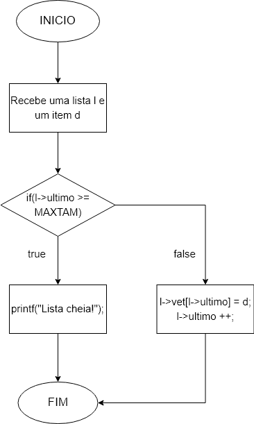
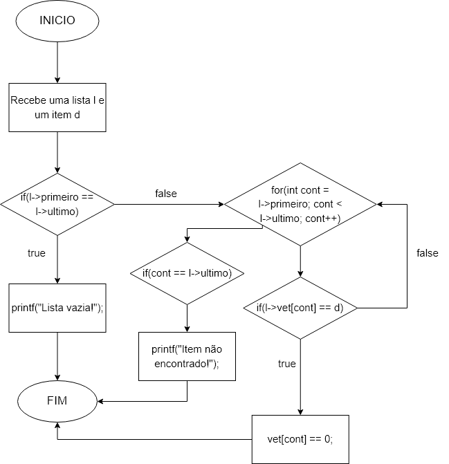

# Exercício 01: Fluxograma

## Problema

Faça um diagrama para representar uma inserção, remoção e pesquisa em uma lista linear.

## Desenvolvimento

### Inserção

 

### Remoção

 

### Pesquisa

 

