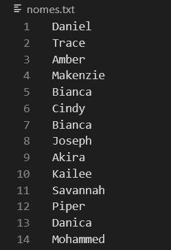
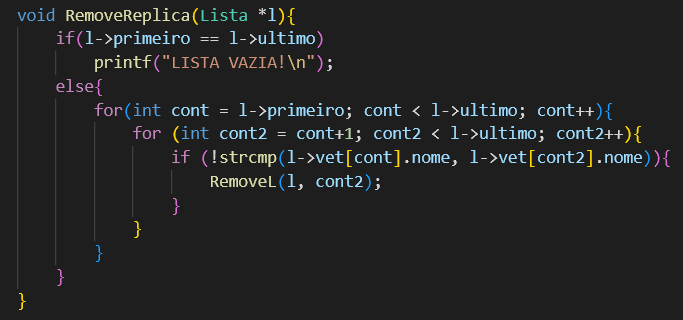
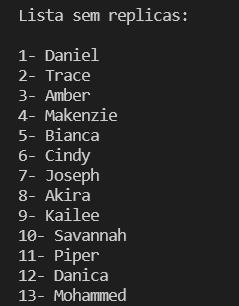

# Exercício 02: Réplicas de nomes

 

## Problema

Crie uma lista linear que consiga armazenar um conjunto de 100 nomes quaisquer, os quais serão salvos de forma aleatória. Feito a estrutura crie as seguintes ações:

* Uma função que consiga identificar replicações na lista, ou seja, nomes iguais. Remova todas as réplicas sem mover os ”ponteiro“
* Como você gerenciaria os espaços em branco para novas inserções? Qual seria o custo dessas novas inserções?

### Resposta

Ao se remover um nome da lista, é colocado no lugar uma string vazia "", dessa forma, para fazer uma nova inserção, basta fazer uma pesquisa pela lista para encontrar aquelas posições em que essas strings vazias se encontram, colocando o novo novo nome que deseha inserir na posição encontrada.

## Desenvlvimento

Primeiramente, é criado um arquivo com 100 nomes, dentre eles algumas repetições, e uma struct Lista, que possui um vetor do tipo Item, com 100 posições, para receber todos os nomes do arquivo.

 

É criada então uma lista vazia, cujos ponteiros de primeira e ultima posição ambos apontam para a primeira posição. Em seguida, é feita a leitura do arquivo e os nomes lidos são salvos no vetor da lista.
Após imprimir a lista de nomes completa, é feita uma pesquisa para encontrar possíveis repetições nesses nomes. Caso sejam encontradas, estas cópias serão removidas, deixando no lugar do nome uma string vazia "".

 

Por fim, é impressa novamente a lista de nomes, porém dessa vez saltando as posições cujo vetor possui uma string vazia "", apresentando assim a lista apenas com os nomes sem repetição.

 

# Compilação e Execução

A lista linear disponibilizada possui um arquivo Makefile que realiza todo o procedimento de compilação e execução. Para tanto, temos as seguintes diretrizes de execução:

| Comando                |  Função                                                                                           |                     
| -----------------------| ------------------------------------------------------------------------------------------------- |
|  `make clean`          | Apaga a última compilação realizada contida na pasta build                                        |
|  `make`                | Executa a compilação do programa utilizando o gcc, e o resultado vai para a pasta build           |
|  `make run`            | Executa o programa da pasta build após a realização da compilação                                 |
