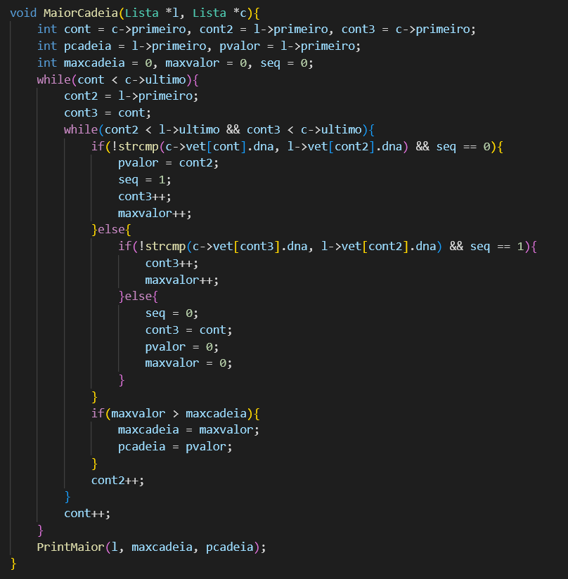
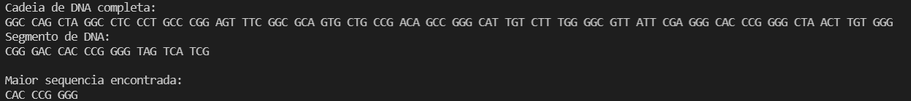

# Exercício 03: Cadeia de DNA

 

## Problema

O problema da máxima cadeia. Elabore um programa que receba uma cadeias de
DNA. Cada posição da cadeia deve conter um códon, ou seja, uma triade de nucleotídeos → T,
A, G, C. Feito isso, leia de um arquivo uma sequência de nucleotídios (i.e.,
ACGTGGCTCTCTAACGTACGTACGTACGGGGTTATATTCGAT) e tente identificar a
maior cadeia da lista que se relaciona a essa entrada.

## Desenvlvimento

Primeiramente, é criado um arquivo com uma grande cadeia de DNA, composta pelas caracteres A, C, G e T, e outro arquivo contendo uma cadeia menos, também com os mesmos caracteres. É criado também uma struct Lista, que possui um vetor do tipo Item, que receberá as cadeias de DNA.
É criada então duas listas vazias, cujos ponteiros de primeira e ultima posição ambos apontam para a primeira posição. Em seguida, é feita a leitura dos arquivo e cada cadeia será salva em uma das listas, salvando os caracteres lidos no vetor das listas agrupados em tríades (3 em 3).
Após imprimir as duas cadeias completas, é feita uma pesquisa para encontrar tríades coincidentes entre as duas cadeias. Caso sejam encontradas, é analisado qual a maior sequência de tríades comum a ambas.

 

Por fim, a maior sequência comum encontrada é impressa.

 

## Compilação e Execução

A lista linear disponibilizada possui um arquivo Makefile que realiza todo o procedimento de compilação e execução. Para tanto, temos as seguintes diretrizes de execução:

| Comando                |  Função                                                                                           |                     
| -----------------------| ------------------------------------------------------------------------------------------------- |
|  `make clean`          | Apaga a última compilação realizada contida na pasta build                                        |
|  `make`                | Executa a compilação do programa utilizando o gcc, e o resultado vai para a pasta build           |
|  `make run`            | Executa o programa da pasta build após a realização da compilação                                 |
